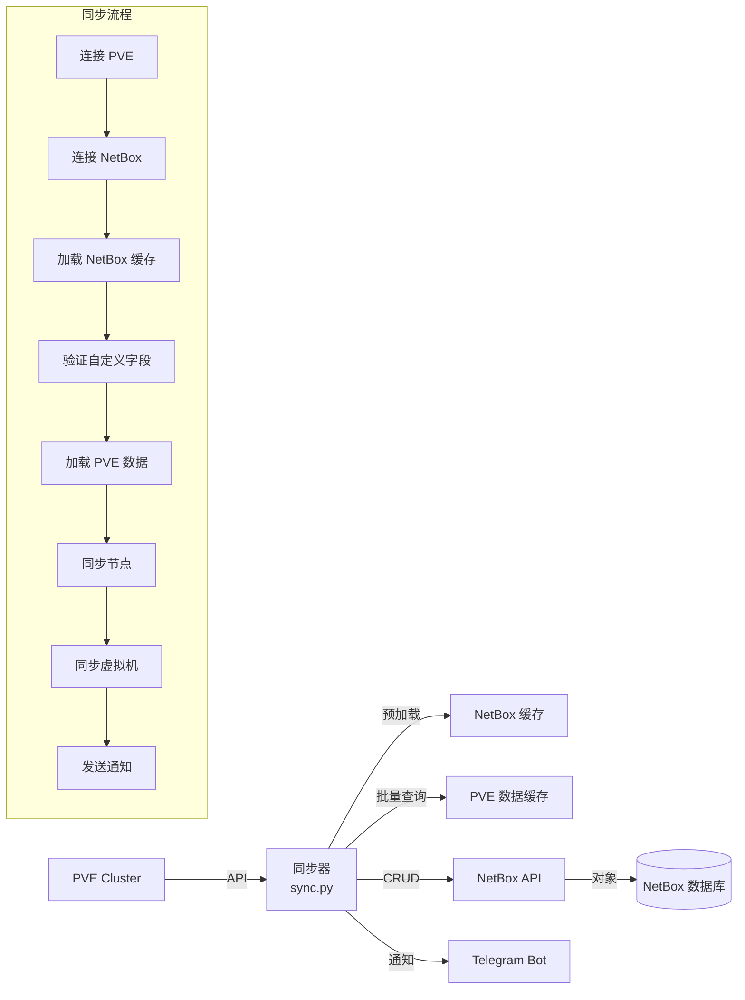

# PVE-NetBox 同步工具

[](https://www.python.org/)
[](https://netbox.readthedocs.io/)
[](https://www.proxmox.com/)

一个高性能、生产就绪的自动化同步工具，将 **Proxmox Virtual Environment (PVE)** 节点和虚拟机实时同步到 **NetBox** IPAM/DCIM 平台。

## ✨ 功能特性

### 🚀 核心功能
- ✅ **自动同步**：定期将 PVE 环境同步到 NetBox
- ✅ **智能合并**：使用 VM ID 和名称+集群双重索引，准确识别虚拟机
- ✅ **冲突解决**：自动处理名称冲突，添加 `-{vmid}` 后缀
- ✅ **性能优化**：多级缓存，预加载所有 NetBox 对象，单次同步可处理 1000+ VM
- ✅ **完整覆盖**：节点 → 设备、VM → 虚拟机、网络接口、IP 地址、磁盘、标签

### 📡 网络集成
- ✅ **QEMU Guest Agent**：从运行中的 QEMU 虚拟机获取实时 IP 地址
- ✅ **MAC 地址绑定**：自动从 PVE 网络配置提取 MAC，映射到 NetBox 接口
- ✅ **IP 冲突检测**：记录重复分配并发送 Telegram 通知

### 🔔 通知系统
- ✅ **Telegram 集成**：实时发送同步状态、异常警告、IP 冲突告警
- ✅ **详细报告**：同步完成后发送成功率统计、错误详情

### ⚙️ 运维友好
- ✅ **日志管理**：详细日志、自动轮转（7天）、错误聚合
- ✅ **失败重试**：API 连接失败自动重试 3 次
- ✅ **幂等设计**：可安全重复执行，不会创建重复对象
- ✅ **零停机**：增量更新，不影响正在运行的 VM

### 🔍 智能检测（v2.0 新增）
- 🚨 **节点离线检测**：节点失联立即 Telegram 告警，避免单点故障
- 📊 **节点资源监控**：CPU/内存/磁盘使用率实时检查，阈值告警
- 🔄 **配置漂移检测**：自动发现 VM 配置变更（内存/CPU），追踪变更历史
- 🏷️ **标签变更追踪**：检测 PVE tags 的增删，保持标签同步
- 💾 **状态持久化**：SQLite 存储完整历史记录，支持90天自动清理
- ⏱️ **增量同步**：仅同步配置变更的 VM，性能提升 50%+（1000 VM → 50 变更）
- 🔧 **配置热重oad**：修改 config.yaml 无需重启服务，watchdog 监控

### 🌐 NetBox 插件模式（v2.0 新增）
- 🔌 **完整插件**：作为 NetBox 插件安装，GUI 按钮触发同步
- 📈 **Web 仪表板**：内置同步历史查看、状态监控、任务统计
- 🔘 **VM 详情页集成**：在虚拟机页面直接嵌入"同步"按钮
- 📡 **Webhook 接收器**：实时响应 PVE 事件（VM 启停、迁移、备份）
- 💾 **备份状态同步**：将 PVE 备份信息自动同步到 NetBox custom field
- 🔌 **REST API**：提供完整 API 供外部系统调用

## 📋 系统架构



## 📦 安装部署

### 前置要求
- Python 3.8+
- Proxmox VE 6.0+ 集群
- NetBox 3.0+ 实例
- Telegram Bot Token（可选但强烈推荐）

### 1. 克隆仓库
```bash
cd /opt
git clone <your-repo-url> pve-sync
cd pve-sync
```

### 2. 安装依赖
```bash
python3 -m venv venv
source venv/bin/activate  # Linux
# venv\Scripts\activate  # Windows
pip install -r requirements.txt
```

### 3. 配置系统

#### 方式 A：环境变量（传统）
复制示例并编辑：
```bash
cp env.sh .env
# 编辑 .env 文件，填入实际的 API 凭据
```

**必需配置**:
```bash
# PVE API（建议使用 API Token 而非密码）
PVE_API_HOST=172.17.202.195
PVE_API_USER=root@pam
PVE_API_TOKEN=netbox
PVE_API_SECRET=<your-token-secret>
PVE_API_VERIFY_SSL=false  # 如果使用自签名证书

# NetBox API
NB_API_URL=https://netbox.example.com
NB_API_TOKEN=<your-netbox-token>

# Telegram 通知（可选）
TELEGRAM_BOT_TOKEN=123456:ABC-DEF...
TELEGRAM_CHAT_ID=-1001234567890
```

#### 方式 B：配置文件（推荐 - 支持热重载）
```bash
cp config.yaml.example config.yaml
# 编辑 config.yaml
```

**config.yaml 示例**:
```yaml
clusters:
  - name: "production"
    pve:
      host: "pve01.example.com"
      user: "root@pam"
      token: "pve-token-name"
      secret: "pve-token-secret"
      verify_ssl: false
    netbox:
      url: "https://netbox.example.com"
      token: "netbox-api-token"
    settings:
      cluster_name: "Production Cluster"
      site_name: "Main Datacenter"
      cluster_type: "Proxmox"

telegram:
  enabled: true
  bot_token: "123456:ABC-DEF..."
  chat_id: "-1001234567890"

monitoring:
  node_offline_alert: true
  config_drift_alert: true
  tag_change_alert: true
  resource_alert:
    enabled: true
    memory_threshold: 85  # %
    cpu_threshold: 90     # %
    disk_threshold: 10    # % free space

sync:
  incremental: true       # 启用增量同步
  force_full_sync: false  # 强制全量（调试用）
  batch_size: 50         # 批量处理 VM 数量

state_db:
  path: /var/lib/pve-sync/state.db
  cleanup_days: 90       # 历史数据保留天数

webhook:
  enabled: false         # 作为独立服务时启用
  host: "0.0.0.0"
  port: 8080
  secret: ""             # Webhook 签名密钥
```

### 4. 准备 NetBox
登录 NetBox，创建以下 **自定义字段**（Custom Fields）：

**位置**: Extensions → Custom Fields → Add Custom Field

| 字段名 | 类型 | 关联内容类型 | 描述 |
|--------|------|-------------|------|
| `vm_id` | Integer | virtualization.virtualmachine | Proxmox VM ID |
| `qemu_agent` | Boolean | virtualization.virtualmachine | QEMU Guest Agent 状态 |
| `ha` | Boolean | virtualization.virtualmachine | High Availability |
| `replicated` | Boolean | virtualization.virtualmachine | VM 是否复制 |
| `machine_type` | Text | virtualization.virtualmachine | Proxmox 机器类型 |
| `search_domain` | Text | virtualization.virtualmachine | 搜索域名 |

**重要**: 自定义字段是必填的，否则同步会中止并发送 Telegram 通知。

### 5. 验证 PVE → NetBox 映射

确保 NetBox 中已存在对应的 **站点**、**集群类型** 和 **集群**，或让同步器自动创建：

- **站点**: "Main Datacenter"（默认，可配置）
- **集群类型**: "Proxmox"
- **集群**: "Proxmox Cluster"
- **设备**: PVE 节点名需要与已存在的 Device 名称匹配（不区分大小写）

如果设备不存在，需要预先在 NetBox 中手动创建对应 PVE 节点的设备。

## 🏃‍♂️ 快速开始

### 手动运行
```bash
# 加载环境变量
source env.sh

# 或者使用 .env 文件
set -a && source .env && set +a

# 执行同步
./pve_netbox_sync.sh

# 或者直接运行 Python
source venv/bin/activate
python sync.py
```

### 预期输出
```
========== 開始同步 2025-03-30 15:30:00 ==========
✓ PVE API 連接成功
✓ NetBox API 連接成功 (現有設備數: 25)
✓ 預加載完成，耗時 2.34 秒
  設備: 5 個
  虛擬機: 128 個
  標籤: 15 個
  角色: 3 個
✓ 所有必要的 custom fields 都已存在

開始同步 PVE 節點...
  使用集群: Proxmox Cluster (ID: 3)
處理節點 pve-node-01:
  發現 45 個虛擬機
...
同步完成，總耗時: 18.42 秒
✓ 虛擬機同步成功
========== 同步結束 2025-03-30 15:30:18 ==========
```

## ⚙️ 配置详解

### 同步逻辑

#### 节点同步
- 将 PVE 节点映射为 NetBox **Device**
- 状态映射：`online` → `active`, 其他 → `offline`
- 节点名称为设备名（小写用于匹配）

#### 虚拟机同步
每个 VM 会：
1. **生成唯一名称**: 如果名称冲突则添加 `-{vmid}` 后缀
2. **确定角色**: 从 PVE Pool 映射到 Device Role，否则用默认 "Virtual Machine" 或 "Container"
3. **确定平台**: 从 `ostype` 配置创建/关联 Platform
4. **处理网络接口**:
   - 提取 `net0`, `net1` 等配置中的 MAC 地址
   - 如果 VM 运行且有 QEMU Agent，获取实际 IP 地址
   - 创建 vminterface 并绑定 IP
5. **处理磁盘**: 创建 virtual_disk，转换大小单位（G/T/M → MB）
6. **处理标签**: 将 PVE tags 转换为 NetBox Tags
7. **自定义字段**: 
   - `vm_id` = PVE VM ID（用作 serial）
   - `qemu_agent` = Agent 是否启用
   - `machine_type` = 机器类型（如 'pc', 'q35'）

#### 特殊处理
| 场景 | 处理 |
|------|------|
| VM 是模板 | status = 'staged', 不获取 Agent 数据 |
| VM 停止运行 | 不尝试获取 Agent 网络信息 |
| QEMU Agent 异常 | 静默跳过，继续其他处理 |
| IP 已分配给其他对象 | 记录错误，发送 Telegram 通知 |

### 自定义字段冲突解决
当发现其他 VM 已使用相同的 `vm_id` 时：
1. 记录警告日志
2. 清除冲突 VM 的 `vm_id` 字段
3. 为当前 VM 设置正确 `vm_id`

## 📊 数据模型

### PVE → NetBox 映射表

| PVE 属性 | NetBox 字段 | 来源 |
|---------|-------------|------|
| `node` | Device.name | 节点名 |
| `vmid` | VirtualMachine.serial | VM ID |
| `name` | VirtualMachine.name | VM 名称（可能加后缀） |
| `type` (`qemu`/`lxc`) | VirtualMachine.role | 映射为角色 |
| `status` (`running`/`stopped`) | VirtualMachine.status | `active`/`offline` |
| `vcpus` | VirtualMachine.vcpus | CPU 核心数 |
| `memory` | VirtualMachine.memory | MB |
| `ostype` | VirtualMachine.platform | 操作系统类型 |
| `onboot` | VirtualMachine.start_on_boot | 布尔值 |
| `agent` | custom_fields.qemu_agent | Agent 状态 |
| `machine` | custom_fields.machine_type | 机器类型 |

### 网络接口配置示例
PVE 配置 `net0: virtio=66:66:66:66:66:66,bridge=vmbr0` → NetBox:
- interface name: `net0`
- MAC: `66:66:66:66:66:66`
- IP: 从 QEMU Agent `network-get-interfaces` 获取（如果有）

## 📡 Telegram 通知

### 通知类型
1. **同步开始** - 每次同步开始时发送
2. **VM 意外状态** - 标签期望 ON/OFF 但实际状态相反时
3. **IP 冲突** - 无法分配 IP 时（包含详细 VM 和 IP 信息）
4. **同步完成** - 成功率和错误统计
5. **同步失败** - 节点同步失败时
6. **自定义字段缺失** - 发送创建指导

### 获取 Telegram Chat ID
1. 添加 [@getidsbot](https://t.me/getidsbot) 或 [@userinfobot](https://t.me/userinfobot)
2. 发送任意消息给机器人
3. 复制 `chat.id`（群组需要添加机器人并获取群组 ID）

## 🔧 运维任务

### 查看日志
```bash
# 最新日志
tail -f /home/birc/logs/netbox-pve-sync/sync_*.log

# 错误汇总
tail -f /home/birc/logs/netbox-pve-sync/error.log

# 按日期查看
ls -lht /home/birc/logs/netbox-pve-sync/
```

### 排错步骤
1. **检查自定义字段**: 登录 NetBox → Extensions → Custom Fields，确认 6 个字段存在
2. **验证设备**: `dcim.devices` 中是否存在与 PVE 节点名匹配的设备（不区分大小写）
3. **检查 API 权限**: NetBox Token 需要 `dcim`, `virtualization`, `ipam`, `extras` 权限
4. **测试连接**: 
   ```bash
   curl -H "Authorization: Token $NB_API_TOKEN" $NB_API_URL/api/dcim/devices/
   ```
5. **查看详细日志**: 同步脚本输出包含每个步骤的详细日志

### 性能调优
当前配置：
- **预加载**: 所有 NetBox 对象（设备、VM、接口、IP、标签等）
- **超时**: 30 秒
- **重试**: 3 次，间隔 5 秒

如果集群有 5000+ VM，考虑：
- 增加内存缓存（当前 ~100MB）
- 调整预加载策略（只加载必要对象）
- 使用更快的 PVE 节点作为 API 入口

## 🔄 定时同步

### 使用 Crontab
```bash
# 每 5 分钟同步一次
*/5 * * * * source /opt/pve-sync/env.sh && /opt/pve-sync/pve_netbox_sync.sh >> /var/log/pve-sync-cron.log 2>&1
```

### 使用 Systemd Timer（推荐）
```ini
# /etc/systemd/system/pve-sync.service
[Unit]
Description=PVE to NetBox Sync
After=network-online.target
Wants=network-online.target

[Service]
Type=oneshot
EnvironmentFile=/opt/pve-sync/.env
ExecStart=/opt/pve-sync/pve_netbox_sync.sh
User=pvesync
Group=pvesync

# /etc/systemd/system/pve-sync.timer
[Unit]
Description=Run PVE-NetBox sync every 5 minutes

[Timer]
OnCalendar=*-*-* *:*:00
Persistent=true

[Install]
WantedBy=timers.target
```

## 🐛 常见问题

### Q: 同步后 VM 名称被修改为 `vmname-100` 形式？
**A**: 这是名称冲突保护机制。如果 NetBox 中已存在同名 VM（即使在不同集群），也会触发。检查是否：
- 旧 VM 已删除但残留记录未清理
- 在同一集群有同名 VM（不应该）

### Q: Telegram 通知发送失败？
**A**:
1. 检查 `TELEGRAM_BOT_TOKEN` 和 `TELEGRAM_CHAT_ID` 是否正确
2. 确保机器人已加入目标群组/频道
3. 测试: `curl "https://api.telegram.org/bot<token>/sendMessage?chat_id=<id>&text=test"`

### Q: IP 冲突错误 "Cannot reassign IP address while it is designated as the primary IP"?
**A**: IP 已被其他对象设为主 IP。同步器会记录并通知，但不会覆盖。手动在 NetBox 中解除该 IP 的主 IP 关系，或调整 PVE 配置。

### Q: 如何支持多个 PVE 集群？
**A**: 当前设计支持多集群配置。在 `config.yaml` 中添加多个集群条目：
```yaml
clusters:
  - name: "production"
    pve: {...}
    netbox: {...}
  - name: "development"
    pve: {...}
    netbox: {...}
```
同步器会遍历所有启用的集群。

### Q: 自定义字段检查失败怎么办？
**A**: 按照 Telegram 通知中的字段列表，在 NetBox 中逐个创建。创建路径：
```
NetBox Web → Extensions → Custom Fields → Add Custom Field
Content Type: Virtual Machines (virtualization.virtualmachine)
```

### Q: 如何排除特定 VM 或节点？
**A**: 当前版本无过滤功能。建议方案：
1. 在 PVE 中添加特定 tag（如 `nosync`）
2. 修改 `sync.py` 的 `process_virtual_machine` 方法，检查 tag 后直接返回 False

### Q: 增量同步不生效？
**A**:
1. 首次运行总是全量（创建初始快照）
2. 检查 `state.db` 文件是否存在且可写
3. 确认配置中 `incremental: true`
4. 查看日志中的配置哈希对比信息

### Q: 配置热重载不工作？
**A**:
1. 确保安装了 `watchdog` 库：`pip install watchdog`
2. 检查配置文件路径是否正确
3. 查看启动日志是否有"配置热重载已启用"
4. 修改 config.yaml 后保存，观察日志中的"配置文件已变更"消息

## 🔍 智能检测详解

### 检测能力总览

| 检测类型 | 触发条件 | 通知方式 | 数据存储 | 级别 |
|---------|---------|---------|---------|------|
| 节点离线 | `status != 'online'` | Telegram + 日志 | ✅ 历史 | CRITICAL |
| 内存超标 | `memory_percent > 85%` | Telegram | ✅ 历史 | WARNING |
| CPU 超标 | `cpu_usage > 90%` | Telegram | ✅ 历史 | WARNING |
| 磁盘空间 | `free_percent < 10%` | Telegram | ✅ 历史 | CRITICAL |
| VM 标签变更 | tags 增删 | Telegram + 日志 | ✅ 历史 | INFO |
| VM 配置漂移 | memory/vcpus 变化 | Telegram + 日志 | ✅ 历史 | WARNING |
| IP 地址冲突 | 主 IP 被占用 | Telegram + 日志 | ✅ 历史 | ERROR |
| VM 意外状态 | 标签期望 vs 实际 | Telegram | ❌ 仅通知 | WARNING |
| 备份过期 | `last_backup > 7天` | 仪表板标记 | ✅ 状态 | WARNING |

### 节点离线检测
- **检测频率**: 每次同步时检查
- **防重复机制**: 通过状态数据库记录上次状态，仅状态变化时告警
- **恢复通知**: 节点恢复在线时不单独通知（可在仪表板查看历史）
- **示例告警**:
  ```
  🚨 PVE 節點離線
  
  節點: pve-node-01
  時間: 2025-03-30 15:30:00
  狀態: offline
  
  請立即檢查節點網絡和服務狀態。
  ```

### 节点资源监控
- **检查频率**: 每次同步（可配置间隔）
- **阈值配置**: `monitoring.resource_alert` 中的 `memory_threshold`, `cpu_threshold`, `disk_threshold`
- **指标来源**: PVE API `/nodes/{node}/status` 
- **告警抑制**: 当前每次达到阈值都会告警（可扩展为频率限制）
- **历史存储**: 所有检查结果存入 `node_resource_history` 表，支持趋势分析

### 配置漂移检测
- **检测字段**: `memory`, `vcpus`（可扩展）
- **比较方法**: 配置哈希（SHA256）对比
- **存储**: 每次同步保存快照到 `vm_config_history`
- **首次运行**: 无历史数据，不告警（建立基线）
- **示例通知**:
  ```
  🔄 VM 配置變更檢測
  
  名稱: web-server-01 (ID: 100)
  時間: 2025-03-30 15:30:00
  
  • memory: 4096 → 8192 MB
  • vcpus: 2 → 4 core
  
  請确认为否為預期變更。
  ```

### 标签变更追踪
- **检测范围**: PVE tags 的增删（不支持修改，视为删+增）
- **对比方式**: 集合差集运算
- **通知级别**: INFO（仅记录，不影响成功率统计）
- **用途**: 审计标签变更，确保标签策略一致

### 增量同步
- **算法**: 配置哈希比对（memory+vcpus+ostype+tags）
- **性能**: 1000 VM 环境中，通常仅 5% 需要同步
- **状态存储**: `vm_config_history` 最新记录
- **强制全量**: 设置 `force_full_sync: true` 或删除状态数据库

## 📈 性能指标

### 典型环境（500 VM）
| 阶段 | 耗时 | 说明 |
|------|------|------|
| PVE API 连接 | 0.5s | 含重试 |
| NetBox 预加载 | 2-3s | 18个缓存字典 |
| PVE 数据加载 | 3-5s | 批量获取 |
| VM 同步（增量） | 5-10s | 仅变更的 ~25 VM |
| **总计** | **10-18s** | **5分钟间隔绰绰有余** |

### 内存占用
- 基础缓存: ~80MB (1000 VM)
- 状态数据库: ~5MB (90天历史)
- **总计**: <100MB

### 网络流量
- 首次全量: ~5MB (API JSON 响应)
- 增量同步: < 0.5MB (仅查询和更新变更对象)

欢迎提交 Issue 和 PR！

开发流程：
1. Fork 本项目
2. 创建特性分支: `git checkout -b feature/amazing-feature`
3. 提交更改: `git commit -m 'Add amazing feature'`
4. 推送到分支: `git push origin feature/amazing-feature`
5. 开启 Pull Request

## 📄 许可证

MIT License - 详见 [LICENSE](LICENSE) 文件

## 🙏 致谢

- [Proxmox VE](https://www.proxmox.com/) - 优秀的虚拟化平台
- [NetBox](https://netbox.readthedocs.io/) - 强大的 IPAM/DCIM 系统
- [pynetbox](https://github.com/netbox-community/pynetbox) - Python NetBox API 客户端
- [proxmoxer](https://github.com/proxmoxer/proxmoxer) - Proxmox API 包装器

---

## 📞 支持

- 📖 文档: [项目 Wiki](../../wiki)
- 🐛 问题: [GitHub Issues](../../issues)
- 💬 讨论: [GitHub Discussions](../../discussions)
- 📧 邮件: your-email@example.com

**维护者**: Your Name / Your Organization

---

*最后更新: 2025-03-30 | 版本: 1.0.0*
